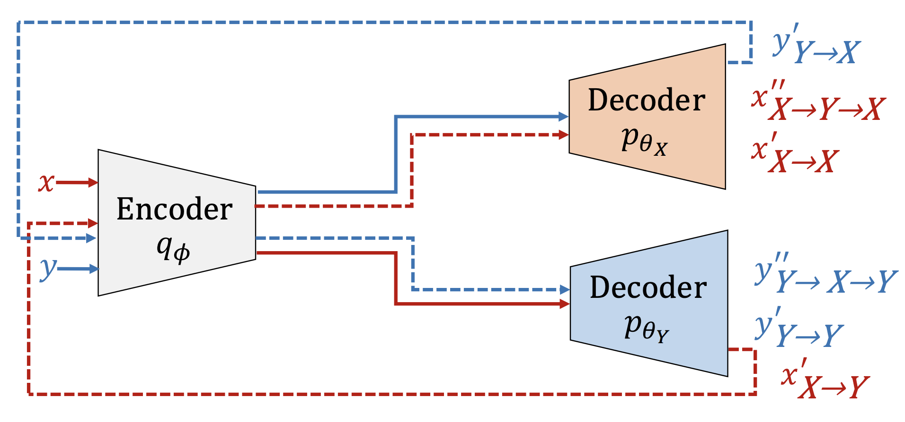

# Encoder-Decoder-Decoder voice conversion

В данном проекте реализуется one-2-one архитектура для подмены голоса.

## Идея

Хотим, имея два голоса их подменять не имея выравнивания и теста. 
Для этого нам понадобится encoder, два decoder и немного терпения. 

## Fit-predict
На стадии обучения модель тренируется как класический encoder-decoder, за исключением того, что теперь у нас есть два decoder-а, каждый из которых отвечает за свой голос.

Для непосредственной подмены голоса, следует прогонять спектрограмму через encoder и далее выбрать декодер, который отвечает за голос, который мы хотим получить.

## Наборы данных
* [LJ-speech](https://www.youtube.com/watch?v=dQw4w9WgXcQ)
* [The World English Bible](https://www.kaggle.com/bryanpark/the-world-english-bible-speech-dataset)

* [Спектограммы датасетов](https://www.kaggle.com/vladislavrr/spectrogram-lj-speech/settings)

Для загрузки весов необходимо воспользоваться командой `git lfs fetch`
